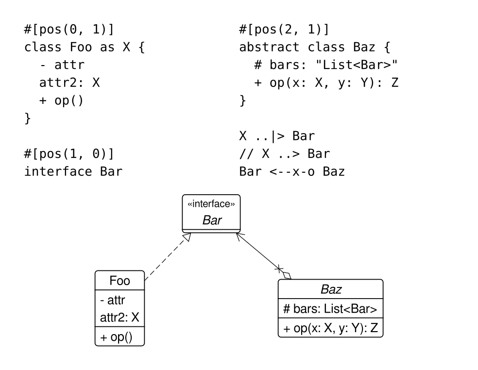

# Plum

_Plum_ lets you create UML class diagrams in Typst; inspired by but _not_ compatible with PlantUML.

## Getting Started

To add this package to your project, use this:

````typ
#import "@preview/plum:0.0.1"

#let diagram = ```
#[pos(0, 1)]
class Foo as X {
  - attr
  attr2
}

#[pos(1, 0)]
interface Bar {
  + attr
}

#[pos(2, 1)]
abstract class Baz {
  # bars
}

#[via((0, 0))]
X ..|> Bar
#[via((1, 0.4), (2, 0.4))]
Bar <--x-o Baz
```

#plum.plum(diagram)
````



## Usage

See the [manual](docs/manual.pdf) for details.
